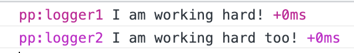
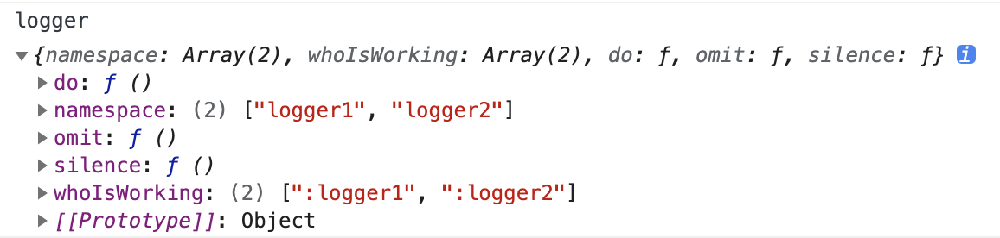

# Logger

二次封装的[debug](https://github.com/visionmedia/debug)，让你项目中的`console.log`更有组织性。

## 序言
在我们日常业务中，涉及很多数值计算，测试同学需要查看各个数值是否正确，项目中就存在很多`console.log`，随着业务增长，在后续的本地开发与测试中，日志信息愈加混乱，一打开控制台日志信息铺天盖地，为了更好的组织和管理日志，能看到自己想要的看到的日志，`Logger`应运而生。

## 用法

#### 基本
```npm i logger```

```typescript
    import Logger from 'logger'
    
    // 首先设置前缀 - 可以是任何你想要的字符
    Logger.prefix = 'pp'

    enum Loggers {
        Default = 'log',
        L1 = 'logger1',
        L2 = 'logger2'
    }

    // 注册一个logger， register的参数为每一个logger的命名空间
    const logger1 = Logger.register(Loggers.L1)
    logger1('I am working hard!')

    // 为了区分不同业务的日志，可以继续注册一个logger
    const logger2 = Logger.register(Loggers.L2)
    logger2('I am working hard too!')

    // 让他们开始干活吧
    Logger.do(Loggers.L1, Loggers.L2)

    // 或者你想只让指定的logger干活 => Logger.do(Loggers.L2)

    // 再或者全都开始干吧 => Logger.do()
```


我们可以通过使用`Logger.bindToWindow`将`logger`注册到`window`上，在控制台中键入`logger`以调用相应的方法。



`logger.namespace`可以查看项目中所有注册的`logger`的`namespace`。

`logger.do(<namespace1_you_want>, <namespace2_you_want>...)`，可以开启项目中已经注册的任意的`logger`。

`logger.omit(<namespace1_you_do_not_want>, <namespace2_you_do_not_want>...)`，可以忽略某些你不想要的`logger`。

`logger.silence()`可以让所有`logger`闭嘴。

`logger.whoIsWorking`可以查看工作中的`logger`。

以上方法在控制台调用之后，刷新完页面后生效。

#### 高级

根据项目的环境变量，我们可以在代码中预设好`Logger`，下面提供我们业务中的配置：
```typescript
const env = process.env.NODE_ENV

switch (env) {
    case 'production': {
        // 生产环境， 彻底禁用Logger，控制台中也无法打开，不产生任何日志
        Logger.disable()
        break
    }
    case 'development': {
        // 测试环境，开启控制台，开启所有logger，测试同学可以通过控制台logger相关命令，自由掌控
        Logger.do()
        bindToWindow()
        break
    }
    case 'local': {
        // 本地环境，开启自己想要的日志
        Logger.do(Loggers.L1)
        bindToWindow()
        break
    }
    default:
        Logger.disable()
}
```

#### VUE
将`logger`绑定到`VUE`上，在`VUE`中就可以通过`this.$log`打印一些通用日志。
```typescript
import Vue from 'vue'

Vue.prototype.$log = Logger.register(Loggers.Default)
```

## 建议
在eslint中开启`no-console`，可以避免将本地开发调试代码时所写的无用的`console.log`提交到git中，
```json
"no-console": ["error", { allow: ["warn", "error"] }]
```
当然`Logger`不会对`console.log`做处理，可以自由选择使用场景。